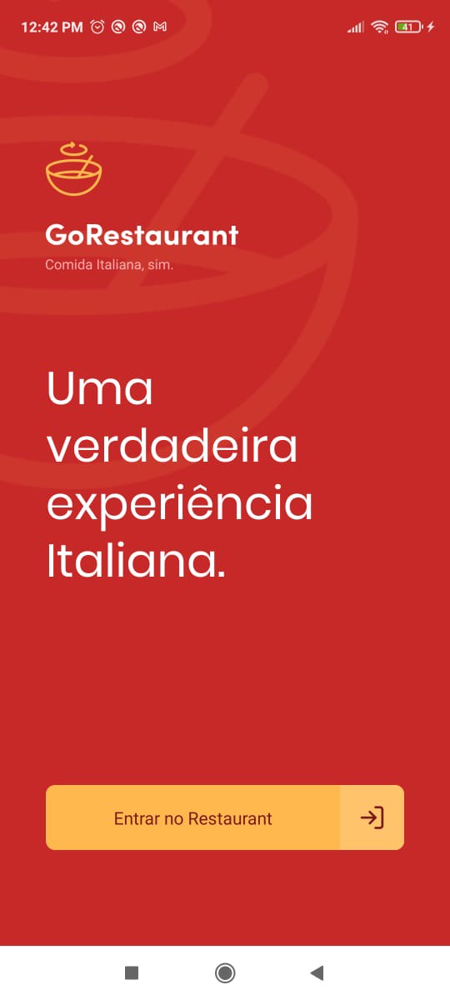
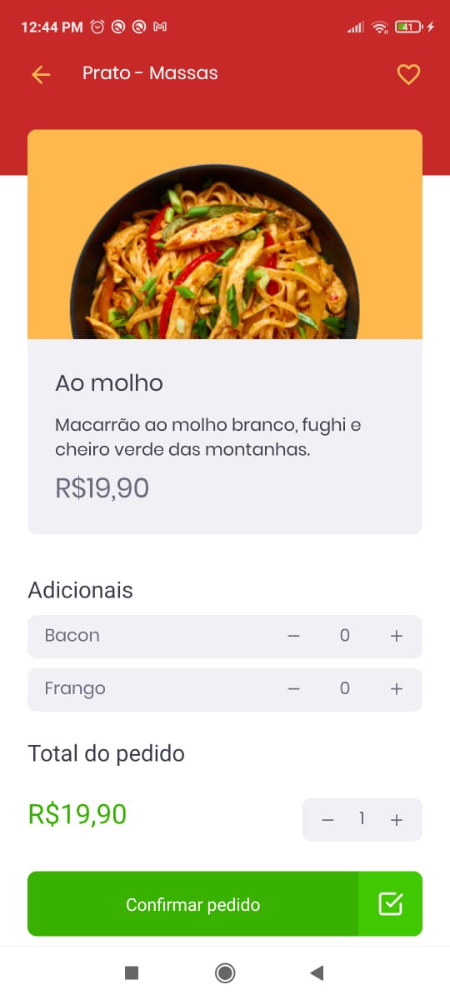
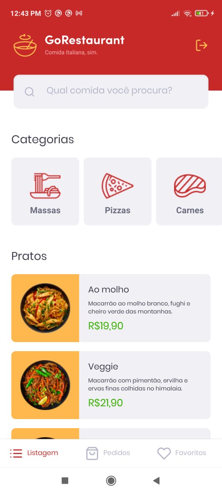

</br>

<p align="center">
  <a>
    
  </a>
</p>

<p align="center">
  Explore the best food you ever seen. Shop meals before they're gone!
</p>

[](https://github.com/guilhermefos)
[](#)
[](https://github.com/guilhermefos/GoRestaurantMobile/stargazers)
[](https://github.com/guilhermefos/GoRestaurantMobile/network/members)
[](https://github.com/guilhermefos/GoRestaurantMobile/graphs/contributors)

<p align="center">
  &nbsp;&nbsp;&nbsp;&nbsp;&nbsp;&nbsp;
  &nbsp;&nbsp;&nbsp;&nbsp;&nbsp;&nbsp;
  
</p>

# :pushpin: Table of Contents

- [Features](#rocket-features)
- [Installation](#construction_worker-installation)
- [Getting Started](#runner-getting-started)
- [FAQ](#postbox-faq)
- [Found a bug? Missing a specific feature?](#bug-issues)
- [Contributing](#tada-contributing)
- [License](#closed_book-license)

# :rocket: Features

- Explore all meals
- Select meals from category
- Add meals to favorite list
- Search for meals
- Order meals

# :construction_worker: Installation

**You need to install [Node.js](https://nodejs.org/en/download/), [Yarn](https://yarnpkg.com/), [Android SDK](https://medium.com/surabayadev/setting-up-react-native-android-without-android-studio-35a496e1dfa3) first and then, in order to clone the project via HTTPS, run this command:**

`git clone https://github.com/guilhermefos/GoRestaurantMobile.git`

SSH URLs provide access to a Git repository via SSH, a secure protocol. If you have a SSH key registered in your Github account, clone the project using this command:

`git@github.com:guilhermefos/GoRestaurantMobile.git`

**Install dependencies**

`yarn install`

**Install IOS native dependencies**

`cd ios && pod install`

# :runner: Getting Started

Run the following command in order to start the application in a development environment:

```
  // Run the json server to access the mock data
  json-server --p 3333 server.json

  // Install the application in a Android device
  yarn android

  // Install the application in a IOS device
  yarn ios

  // Start the mobile application as well the fake server to retrieve products data
  yarn dev
```

# :postbox: Faq

**Question:** What are the tecnologies used in this project?

**Answer:** The tecnologies used in this project are [React Native](https://reactnative.dev/) + [Styled Components](https://styled-components.com/) to handle scoped CSS.

# :bug: Issues

Feel free to **file a new issue** with a respective title and description on the the [GoRestaurantMobile](https://github.com/guilhermefos/GoRestaurantMobile/issues) repository. If you already found a solution to your problem, **i would love to review your pull request**! Have a look at our [contribution guidelines](https://github.com/guilhermefos/GoRestaurantMobile/blob/master/CONTRIBUTING.md) to find out about the coding standards.

# :tada: Contributing

Check out the [contributing](https://github.com/guilhermefos/GoRestaurantMobile/blob/master/CONTRIBUTING.md) page to see the best places to file issues, start discussions and begin contributing.

# :closed_book: License

Released in 2020.
This project is under the [MIT license](https://github.com/guilhermefos/GoRestaurantMobile/blob/master/LICENSE).

Made to fly by [Guilherme Oliveira](https://github.com/guilhermefos) 🚀
